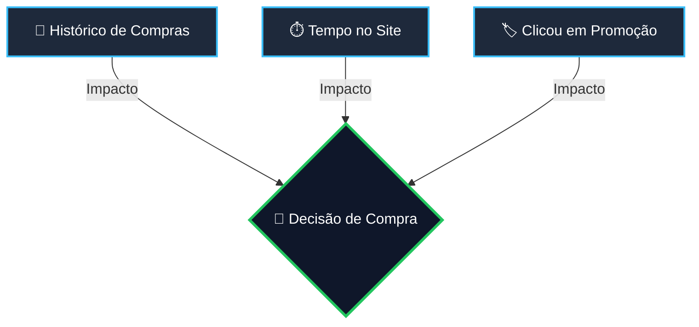

<div align="center">

# 🧠 Bayesian Customer Intelligence (BCI)

  <p align="center">
    <strong>Modelo Probabilístico de Inferência de Intenção de Compra em E-Commerce</strong>
  </p>

  <!-- BADGES / SHIELDS -->
  <p align="center">
    
    
    
  </p>

</div>

---

> [!NOTE]
> **Contexto do Projeto:**  
> Projeto desenvolvido durante o programa **Tech Builder**, focado na implementação prática de **Redes Bayesianas** para tomada de decisão em sistemas de e-commerce.

---

## 📖 Contexto e Problema de Negócio

Em plataformas de e-commerce, identificar a **propensão de compra** de um usuário em tempo real permite personalizar ofertas, ativar gatilhos de retenção e otimizar campanhas de marketing. 

Este projeto constrói um **Modelo de Inferência Bayesiana** simples que calcula a probabilidade de um cliente finalizar uma compra ($P(\text{Compra})$) com base em seu comportamento imediato de navegação no site.

---

## 🕸️ Estrutura da Rede Bayesiana

A rede avalia como três variáveis de entrada (**Evidências**) influenciam a variável dependente alvo (**Compra**):



---

## 🛠️ Como o Código Funciona por Baixo dos Panos

O script foi projetado em Python sem a necessidade de bibliotecas externas complexas, utilizando estruturas de dados nativas de alta performance. A lógica é dividida em **3 pilares principais**:

### 1. Mapeamento da Tabela de Probabilidade Condicional (CPT)
Para representar a rede, utiliza-se um dicionário `probabilidades` onde a chave da variável `"Compra"` é uma **tupla contendo a combinação binária** $(H, T, P)$:
* $H =$ `HistoricoCompras` ($0$ para não, $1$ para sim)
* $T =$ `TempoNoSite` ($0$ para pouco, $1$ para muito)
* $P =$ `ClicouEmPromocao` ($0$ para não, $1$ para sim)

```python
# A chave da CPT é uma Tupla: (Historico, Tempo, Promocao) -> Valor: P(Compra = 1)
"Compra": {
    (0, 0, 0): 0.1,  # P(Compra | Sem Histórico, Pouco Tempo, Sem Clique) = 10%
    (0, 0, 1): 0.3,  # P(Compra | Sem Histórico, Pouco Tempo, Com Clique) = 30%
    (0, 1, 0): 0.2,  # P(Compra | Sem Histórico, Muito Tempo, Sem Clique) = 20%
    (0, 1, 1): 0.6,  # P(Compra | Sem Histórico, Muito Tempo, Com Clique) = 60%
    (1, 0, 0): 0.4,  # P(Compra | Com Histórico, Pouco Tempo, Sem Clique) = 40%
    (1, 0, 1): 0.7,  # P(Compra | Com Histórico, Pouco Tempo, Com Clique) = 70%
    (1, 1, 0): 0.8,  # P(Compra | Com Histórico, Muito Tempo, Sem Clique) = 80%
    (1, 1, 1): 0.9   # P(Compra | Com Histórico, Muito Tempo, Com Clique) = 90%
}
```

> **Por que usar Tuplas como chave?**  
> Em Python, tuplas são estruturas imutáveis e possuem suporte nativo a Hash Table. Usar a tupla `(H, T, P)` como chave do dicionário permite realizar a busca direta da probabilidade em **tempo constante $O(1)$**, substituindo completamente estruturas lentas ou repetitivas de `if/else`.

---

### 2. A Função de Inferência `calcular_probabilidade_compra`
A função recebe um dicionário de evidências do cliente e realiza o cálculo da distribuição de probabilidade para a tomada de decisão:

```python
def calcular_probabilidade_compra(evidencias):
    # 1. Extrai os valores das evidências
    historico = evidencias["HistoricoCompras"]
    tempo = evidencias["TempoNoSite"]
    promocao = evidencias["ClicouEmPromocao"]

    # 2. Constrói a tupla de busca para a CPT
    prob_compra = probabilidades["Compra"][(historico, tempo, promocao)]
    
    # 3. Aplica a Regra do Complementar
    prob_nao_compra = 1 - prob_compra

    return {"Comprar": prob_compra, "Não Comprar": prob_nao_compra}
```

---

### 3. A Matemática: Regra do Complementar
O modelo garante consistência probabilística respeitando a **Regra do Evento Complementar**:

$$P(\text{Não Comprar}) = 1 - P(\text{Comprar})$$

Como o espaço amostral para a tomada de decisão do cliente é binário (ele finaliza o pedido ou abandona a sessão), a soma de ambas as probabilidades é rigorosamente igual a $1.0$ ($100\%$).

---

## 📊 Variáveis Comportamentais do Modelo

| Variável | Tipo | Valores Válidos | Descrição Negocial |
| :--- | :---: | :---: | :--- |
| **`HistoricoCompras`** | Evidência | `0` / `1` | `0`: Cliente Novo \| `1`: Cliente Recorrente |
| **`TempoNoSite`** | Evidência | `0` / `1` | `0`: Sessão Curta (<2 min) \| `1`: Sessão Longa (>2 min) |
| **`ClicouEmPromocao`** | Evidência | `0` / `1` | `0`: Ignorou ofertas \| `1`: Interagiu com banner promo |
| **`Compra`** | **Alvo** | Probabilidade | **Resultado da Inferência Bayesiana** |

---

## 🚀 Como Executar o Projeto

### 📋 Pré-requisitos
* Python 3.8+ instalado.

### 💻 Executando no Terminal

```bash
# 1. Clone o repositório
git clone [https://github.com/SEU_USUARIO/Bayesian-Customer-Intelligence.git](https://github.com/SEU_USUARIO/Bayesian-Customer-Intelligence.git)

# 2. Acesse a pasta do projeto
cd "Bayesian Customer Intelligence (BCI)"

# 3. Execute o script principal
python index.py
```

---

## 🖥️ Saída Esperada no Terminal

```text
===============================================
   ANALISADOR DE PROBABILIDADE DE CONVERSÃO  
===============================================
Evidências analisadas: {'HistoricoCompras': 1, 'TempoNoSite': 0, 'ClicouEmPromocao': 1}

 -> Comprar: 0.70 (70%)
 -> Não Comprar: 0.30 (30%)
===============================================
```

---

<div align="center">
  <p>Desenvolvido por <strong>João Victor Sitta</strong> durante a jornada <strong>Tech Builder</strong> 🚀</p>
</div>
